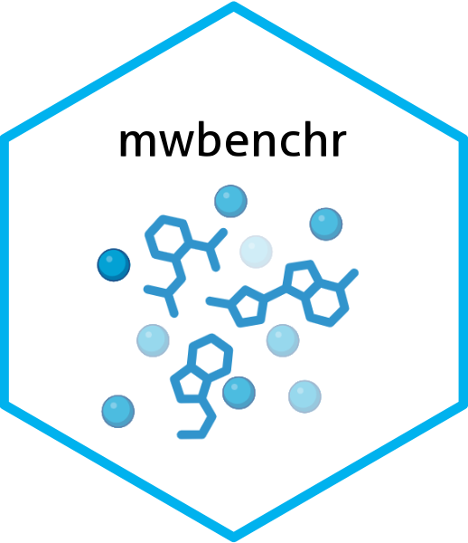

<!-- README.md is generated from README.Rmd. Please edit that file -->

```{r, include = FALSE}
knitr::opts_chunk$set(
  collapse = TRUE,
  comment = "#>"
)
```

# mwbenchr 

<!-- badges: start -->
<!-- [](https://github.com/danymukesha/mwbenchr/actions/workflows/R-CMD-check.yaml) -->
<!-- [](https://app.codecov.io/gh/danymukesha/mwbenchr?branch=main) -->
<!-- [](https://lifecycle.r-lib.org/articles/stages.html#stable) -->
<!-- [](https://bioconductor.org/checkResults/release/bioc-LATEST/mwbenchr) -->
[](https://app.codecov.io/gh/danymukesha/mwbenchr)
<!-- badges: end -->

Our mission:

- **To cover all REST API endpoints** provided by the [Metabolomics Workbench](https://www.metabolomicsworkbench.org/) REST API (v1.2).
- **To ensure type safety** through strict validation of inputs and outputs.
- **To deliver tidy outputs** as well-structured `data.frame`s ready for analysis.
- **To support efficient workflows** with optional local caching of API responses.
- **To respect API rate limits** with built-in request throttling and retry logic.
- **To enhance user experience** with clear and informative API messages.

**mwbenchr** enables programmatic access to metabolomics data, compound information, 
study metadata, and analytical tools from one of the largest metabolomics data repositories.

Use-case:

```{r}
## ----setup, include=FALSE-----------------------------------------------------
knitr::opts_chunk$set(echo = TRUE)

## ----initialize---------------------------------------------------------------
library(mwbenchr)
client <- mw_rest_client()

## ----compound-----------------------------------------------------------------
# Get compound information by PubChem CID
compound <- get_compound_by_pubchem_cid(client, 5281365)
head(compound)

## ----study--------------------------------------------------------------------
# Get study summary
study <- get_study_summary(client, "ST000001")
head(study)

## ----metstat------------------------------------------------------------------
# Search for diabetes studies in human blood
diabetes_studies <- search_metstat(
  client,
  species = "Human",
  sample_source = "Blood",
  disease = "Diabetes"
)
head(diabetes_studies)
```

## All Features

- **Study Access**: Retrieve study summaries, experimental factors, metabolite lists, and complete data matrices
- **Compound Information**: Access detailed compound data using registry numbers or PubChem CIDs
- **RefMet Integration**: Standardize metabolite names using RefMet nomenclature
- **Mass Spectrometry Tools**: Search compounds by mass and calculate exact masses for lipids
- **Flexible Search**: Find studies using multiple criteria (species, sample type, analytical method)
- **Built-in Caching**: Optional response caching for improved performance
- **Robust Error Handling**: Informative error messages and automatic retries

## Functions Implementation

| Function Category | Functions | Description |
|-------------------|-----------|-------------|
| **Client Setup** | `mw_rest_client()` | Initialize API client with configuration |
| **Study Data** | `get_study_summary()`, `get_study_factors()`, `get_study_metabolites()`, `get_study_data()` | Access study information and data |
| **Compound Info** | `get_compound_by_regno()`, `get_compound_by_pubchem_cid()`, `get_compound_classification()` | Retrieve compound details |
| **RefMet** | `get_refmet_by_name()`, `standardize_to_refmet()`, `get_all_refmet_names()` | Work with standardized metabolite names |
| **Search** | `search_metstat()`, `search_by_mass()` | Find studies and compounds |
| **Mass Spec** | `calculate_exact_mass()` | Calculate exact masses for lipids |
| **Utilities** | `response_to_df()`, `list_endpoints()`, `download_compound_structure()`, `flatten_entry()`, `mwbenchr()`, `parse_mw_output()`, `rint.mw_rest_client()` | Data processing and help |

## Advanced Usage

### Enable Caching for Better Performance

```r
# Enable caching for repeated queries
client <- mw_rest_client(cache = TRUE, cache_dir = "~/.mwbenchr_cache")

# This will be cached
refmet_names <- get_all_refmet_names(client)
```

### Search with Multiple Criteria

```r
# Find LCMS studies of mouse liver samples
mouse_liver <- search_metstat(client,
                             analysis_type = "LCMS",
                             species = "Mouse",
                             sample_source = "Liver")

# Search for diabetes-related studies with specific metabolite
diabetes_glucose <- search_metstat(client,
                                  disease = "Diabetes",
                                  refmet_name = "Glucose")
```

### Mass Spectrometry Workflows

```r
# Search for compounds by accurate mass
matches <- search_by_mass(client,
                         db = "REFMET",
                         mz = 180.063,
                         ion_type = "M+H",
                         tolerance = 0.01)

# Calculate exact mass for lipid
pc_mass <- calculate_exact_mass(client, "PC(34:1)", "M+H")
```


