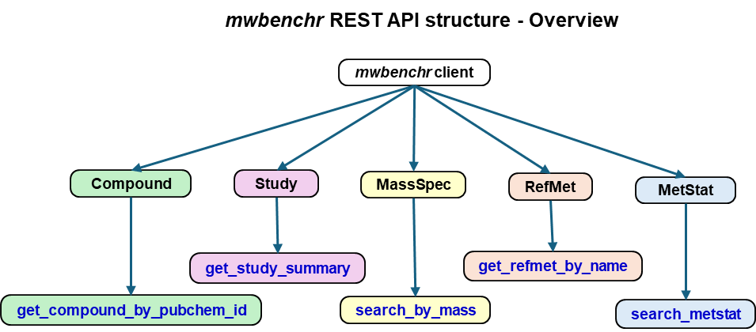
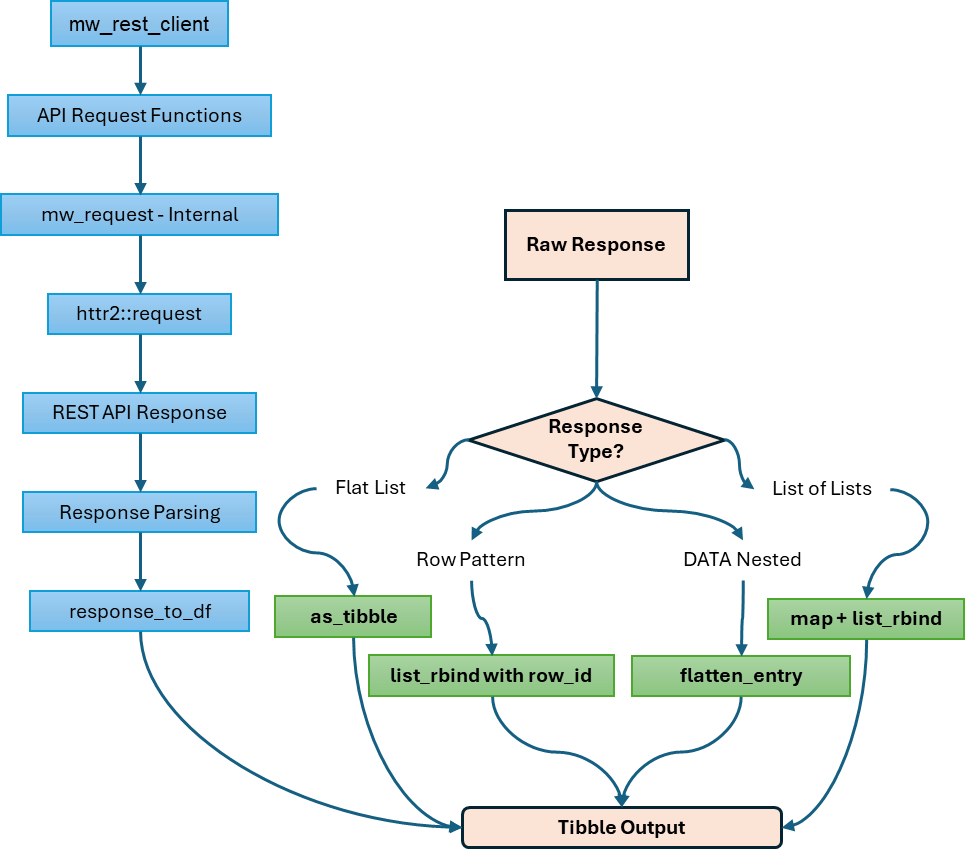

# `mwbenchr` API Schema Documentation

## Overview

This document provides a complete schema of all `mwbenchr` functions,
their parameters, return types, and the underlying REST API endpoints
they access.



## Function Categories

```         
mwbenchr
├── Client Management
│   ├── mw_rest_client()
│   └── print.mw_rest_client()
├── Study Functions
│   ├── get_study_summary()
│   ├── get_study_factors()
│   ├── get_study_metabolites()
│   └── get_study_data()
├── Compound Functions
│   ├── get_compound_by_regno()
│   ├── get_compound_by_pubchem_cid()
│   ├── get_compound_classification()
│   └── download_compound_structure()
├── RefMet Functions
│   ├── get_refmet_by_name()
│   ├── standardize_to_refmet()
│   └── get_all_refmet_names()
├── Search Functions
│   ├── search_metstat()
│   └── search_by_mass()
├── Mass Spectrometry
│   └── calculate_exact_mass()
└── Utilities
    ├── response_to_df()
    ├── flatten_entry()
    └── list_endpoints()
```

------------------------------------------------------------------------

## 1. Client Management

### `mw_rest_client()`

**Purpose**: Initialize REST client for API interactions

**Parameters**:

``` r
mw_rest_client(
  base_url = "https://www.metabolomicsworkbench.org/rest",  # Character
  cache = FALSE,                                            # Logical
  cache_dir = tempdir(),                                   # Character
  timeout = 30                                             # Numeric
)
```

**Returns**: S3 object of class `"mw_rest_client"`

``` r
Structure:
├── base_url    : Character - API base URL
├── cache       : Logical - Caching enabled?
├── cache_dir   : Character - Cache directory path
└── timeout     : Numeric - Request timeout (seconds)
```

**REST Endpoint**: N/A (local object creation)

------------------------------------------------------------------------

## 2. Study Functions

### `get_study_summary()`

**Purpose**: Retrieve study metadata and summary information

**Parameters**:

``` r
get_study_summary(
  client,                    # mw_rest_client object
  study_id = "ST",          # Character - Study ID or "ST" for all
  format = "json"           # Character - "json" or "txt"
)
```

**REST Endpoint**: `GET /study/study_id/{study_id}/summary[/{format}]`

**Returns**: 
- **JSON format**: Tibble with columns:

  ```r
  ├── study_id          : Character
  ├── study_title       : Character  
  ├── study_type        : Character
  ├── institute         : Character
  ├── department        : Character
  ├── last_name         : Character
  ├── first_name        : Character
  ├── email             : Character
  ├── phone             : Character
  ├── submit_date       : Character (YYYY-MM-DD)
  ├── study_summary     : Character
  └── [additional metadata columns]
  ```
- **TXT format**: Character string

### `get_study_factors()`

**Purpose**: Get experimental design factors (sample metadata)

**Parameters**:

``` r
get_study_factors(
  client,         # mw_rest_client object
  study_id        # Character - Study ID
)
```

**REST Endpoint**: `GET /study/study_id/{study_id}/factors`

**Returns**: Tibble with experimental factors

``` r
├── local_sample_id   : Character
├── sample_id         : Character
├── subject_id        : Character
├── factor_name       : Character
├── factor_value      : Character
└── [study-specific factor columns]
```

### `get_study_metabolites()`

**Purpose**: Get list of metabolites measured in a study

**Parameters**:

``` r
get_study_metabolites(
  client,         # mw_rest_client object
  study_id        # Character - Study ID
)
```

**REST Endpoint**: `GET /study/study_id/{study_id}/metabolites`

**Returns**: Tibble with metabolite information

``` r
├── metabolite_id     : Character
├── metabolite_name   : Character
├── refmet_name       : Character
├── pubchem_cid       : Character
├── kegg_id           : Character
├── other_id          : Character
├── other_id_type     : Character
└── ri                : Numeric (retention index)
```

### `get_study_data()`

**Purpose**: Get complete data matrix for a study

**Parameters**:

``` r
get_study_data(
  client,         # mw_rest_client object
  study_id        # Character - Study ID
)
```

**REST Endpoint**: `GET /study/study_id/{study_id}/data`

**Returns**: Tibble with metabolite data across samples

``` r
├── study_id          : Character
├── analysis_id       : Character
├── analysis_summary  : Character
├── metabolite_name   : Character
├── metabolite_id     : Character
├── refmet_name       : Character
├── units             : Character
└── [sample columns]  : Numeric - One column per sample
```

------------------------------------------------------------------------

## 3. Compound Functions

### `get_compound_by_regno()`

**Purpose**: Retrieve compound information by registry number

**Parameters**:

``` r
get_compound_by_regno(
  client,                    # mw_rest_client object
  regno,                     # Character/Numeric - Registry number
  fields = "all",           # Character - Fields to return
  format = "json"           # Character - "json" or "txt"
)
```

**REST Endpoint**: `GET /compound/regno/{regno}/{fields}[/{format}]`

**Available Fields**: "all", "name", "systematic_name", "formula",
"pubchem_cid", "inchi_key", "smiles"

**Returns**: Tibble with compound information

``` r
├── regno             : Character
├── name              : Character
├── systematic_name   : Character
├── formula           : Character
├── pubchem_cid       : Character
├── inchi_key         : Character
├── smiles            : Character
├── iso_smiles        : Character
└── [additional fields depending on 'fields' parameter]
```

### `get_compound_by_pubchem_cid()`

**Purpose**: Retrieve compound information by PubChem CID

**Parameters**:

``` r
get_compound_by_pubchem_cid(
  client,                    # mw_rest_client object
  cid,                       # Character/Numeric - PubChem CID
  fields = "all",           # Character - Fields to return
  format = "json"           # Character - "json" or "txt"
)
```

**REST Endpoint**: `GET /compound/pubchem_cid/{cid}/{fields}[/{format}]`

**Returns**: Same structure as `get_compound_by_regno()`

### `get_compound_classification()`

**Purpose**: Get taxonomic classification hierarchy for a compound

**Parameters**:

``` r
get_compound_classification(
  client,         # mw_rest_client object
  id_type,        # Character - "regno", "pubchem_cid", etc.
  id_value        # Character/Numeric - Identifier value
)
```

**REST Endpoint**: `GET /compound/{id_type}/{id_value}/classification`

**Returns**: Tibble with classification hierarchy

``` r
├── kingdom           : Character
├── super_class       : Character
├── class            : Character
├── sub_class        : Character
├── direct_parent    : Character
└── molecular_framework : Character
```

### `download_compound_structure()`

**Purpose**: Download molecular structure files

**Parameters**:

``` r
download_compound_structure(
  client,                    # mw_rest_client object
  id_type,                   # Character - Identifier type
  id_value,                  # Character/Numeric - Identifier value
  format = "molfile"        # Character - "molfile" or "sdf"
)
```

**REST Endpoint**: `GET /compound/{id_type}/{id_value}/{format}`

**Returns**: Character string containing structure file content

------------------------------------------------------------------------

## 4. RefMet Functions

### `get_refmet_by_name()`

**Purpose**: Get RefMet information for a metabolite

**Parameters**:

``` r
get_refmet_by_name(
  client,                    # mw_rest_client object
  name,                      # Character - RefMet name
  fields = "all"            # Character - Fields to return
)
```

**REST Endpoint**: `GET /refmet/name/{name}/{fields}`

**Available Fields**: "all", "name", "formula", "exactmass",
"pubchem_cid", "inchi_key", "smiles"

**Returns**: Tibble with RefMet information

``` r
├── refmet_name       : Character
├── formula           : Character
├── exactmass         : Numeric
├── pubchem_cid       : Character
├── inchi_key         : Character
├── smiles            : Character
├── super_class       : Character
├── main_class        : Character
└── sub_class         : Character
```

### `standardize_to_refmet()`

**Purpose**: Convert metabolite name to RefMet standard

**Parameters**:

``` r
standardize_to_refmet(
  client,         # mw_rest_client object
  name            # Character - Metabolite name to standardize
)
```

**REST Endpoint**: `GET /refmet/match/{name}/name`

**Returns**: Tibble with standardization result

``` r
├── input_name        : Character
├── refmet_name       : Character
├── formula           : Character
├── exactmass         : Numeric
└── pubchem_cid       : Character
```

### `get_all_refmet_names()`

**Purpose**: Retrieve all RefMet standardized names

**Parameters**:

``` r
get_all_refmet_names(
  client          # mw_rest_client object
)
```

**REST Endpoint**: `GET /refmet/name`

**Returns**: Tibble with all RefMet names

``` r
├── refmet_name       : Character
├── pubchem_cid       : Character
├── exactmass         : Numeric
└── formula           : Character
```

------------------------------------------------------------------------

## 5. Search Functions

### `search_metstat()`

**Purpose**: Search studies using multiple criteria

**Parameters**:

``` r
search_metstat(
  client,                    # mw_rest_client object
  analysis_type = "",        # Character - "LCMS", "GCMS", "NMR", etc.
  polarity = "",            # Character - "POSITIVE", "NEGATIVE"
  chromatography = "",      # Character - "HILIC", "RP", etc.
  species = "",             # Character - "Human", "Mouse", "Rat", etc.
  sample_source = "",       # Character - "Blood", "Urine", "Tissue", etc.
  disease = "",             # Character - Disease/condition
  kegg_id = "",             # Character - KEGG compound ID
  refmet_name = ""          # Character - RefMet metabolite name
)
```

**REST Endpoint**:
`GET /metstat/{analysis_type};{polarity};{chromatography};{species};{sample_source};{disease};{kegg_id};{refmet_name}`

**Returns**: Tibble with matching studies

``` r
├── study_id          : Character
├── analysis_id       : Character
├── metabolite_name   : Character
├── refmet_name       : Character
├── analysis_type     : Character
├── ms_type           : Character
├── ionization        : Character
├── chromatography_type : Character
├── species           : Character
├── sample_source     : Character
└── [additional study metadata]
```

### `search_by_mass()`

**Purpose**: Search compounds by accurate mass

**Parameters**:

``` r
search_by_mass(
  client,                    # mw_rest_client object
  db,                        # Character - "MB", "LIPIDS", "REFMET"
  mz,                        # Numeric - Mass-to-charge ratio
  ion_type,                  # Character - "M+H", "M-H", "M+Na", etc.
  tolerance,                 # Numeric - Mass tolerance (Daltons)
  format = "json"           # Character - "json" or "txt"
)
```

**REST Endpoint**:
`GET /moverz/{db}/{mz}/{ion_type}/{tolerance}[/{format}]`

**Returns**: Tibble with matching compounds

``` r
├── refmet_name       : Character
├── formula           : Character
├── exactmass         : Numeric
├── regno             : Character
├── pubchem_cid       : Character
├── kegg_id           : Character
├── mass_difference   : Numeric
└── lipid_category    : Character (for LIPIDS db)
```

------------------------------------------------------------------------

## 6. Mass Spectrometry Tools

### `calculate_exact_mass()`

**Purpose**: Calculate exact mass for lipid species

**Parameters**:

``` r
calculate_exact_mass(
  client,                    # mw_rest_client object
  lipid_abbrev,             # Character - Lipid abbreviation (e.g., "PC(34:1)")
  ion_type                  # Character - Ion type (e.g., "M+H", "M-H")
)
```

**REST Endpoint**: `GET /moverz/exactmass/{lipid_abbrev}/{ion_type}`

**Returns**: Tibble with calculated mass

``` r
├── lipid_abbreviation : Character
├── ion_type          : Character
├── exactmass         : Numeric
├── formula           : Character
└── adduct_mass       : Numeric
```

------------------------------------------------------------------------

## 7. Utility Functions

### `response_to_df()`

**Purpose**: Convert API responses to tibbles

**Parameters**:

``` r
response_to_df(
  response        # List - Parsed API response
)
```

**Input Types Handled**: 

1. **Flat named lists**: `list(name = "value", id = 123)` 

2. **Row-based responses**: `list(Row1 = list(...), Row2 = list(...))` 

3. **Nested DATA responses**: `list(metadata..., DATA = data.frame(...))` 

4. **Lists of lists**: `list(list(...), list(...))`

**Returns**: Tibble (structure depends on input type)

### `flatten_entry()`

**Purpose**: Flatten metabolite entries with nested sample data

**Parameters**:

``` r
flatten_entry(
  entry           # List - Single metabolite entry with DATA field
)
```

**Required Entry Structure**:

``` r
entry:
├── study_id          : Character (optional)
├── analysis_id       : Character (optional)
├── analysis_summary  : Character (optional)
├── metabolite_name   : Character (optional)
├── metabolite_id     : Character (optional)
├── refmet_name       : Character (optional)
├── units             : Character (optional)
└── DATA              : Data.frame (required)
    ├── sample1       : Numeric
    ├── sample2       : Numeric
    └── [more samples]: Numeric
```

**Returns**: Single-row tibble with flattened structure

### `list_endpoints()`

**Purpose**: Display available API endpoints

**Parameters**:

``` r
list_endpoints(
  client          # mw_rest_client object (for method dispatch)
)
```

**Returns**: NULL (called for side effects - prints to console)

------------------------------------------------------------------------

## API Endpoint Mapping

### Complete REST API Endpoint Reference

| Function | HTTP Method | Endpoint Pattern | Description |
|-----------------|-----------------|---------------------|-----------------|
| `get_study_summary()` | GET | `/study/study_id/{id}/summary[/{format}]` | Study metadata |
| `get_study_factors()` | GET | `/study/study_id/{id}/factors` | Experimental factors |
| `get_study_metabolites()` | GET | `/study/study_id/{id}/metabolites` | Metabolite list |
| `get_study_data()` | GET | `/study/study_id/{id}/data` | Complete data matrix |
| `get_compound_by_regno()` | GET | `/compound/regno/{regno}/{fields}[/{format}]` | Compound by registry number |
| `get_compound_by_pubchem_cid()` | GET | `/compound/pubchem_cid/{cid}/{fields}[/{format}]` | Compound by PubChem CID |
| `get_compound_classification()` | GET | `/compound/{id_type}/{id}/classification` | Compound taxonomy |
| `download_compound_structure()` | GET | `/compound/{id_type}/{id}/{format}` | Structure files |
| `get_refmet_by_name()` | GET | `/refmet/name/{name}/{fields}` | RefMet information |
| `standardize_to_refmet()` | GET | `/refmet/match/{name}/name` | Name standardization |
| `get_all_refmet_names()` | GET | `/refmet/name` | All RefMet names |
| `search_metstat()` | GET | `/metstat/{param1};{param2};...;{param8}` | Multi-criteria search |
| `search_by_mass()` | GET | `/moverz/{db}/{mz}/{ion_type}/{tolerance}[/{format}]` | Mass-based search |
| `calculate_exact_mass()` | GET | `/moverz/exactmass/{lipid}/{ion_type}` | Exact mass calculation |

------------------------------------------------------------------------

## Parameter Value Specifications

### Database Identifiers

**Study IDs**: - Format: `"ST" + 6-digit number` (e.g., "ST000001") -
Special: `"ST"` returns all studies

**Registry Numbers**: - Format: Numeric string (e.g., "1", "123") - Used
in Metabolomics Workbench internal system

**PubChem CIDs**: - Format: Numeric string (e.g., "5793") - Links to
PubChem database

### Analysis Types

```         
Valid values: "LCMS", "GCMS", "GCMS_TMS", "HILIC", "RP", "NMR", "MS", "MSn"
```

### Ion Types

```         
Common values: "M+H", "M-H", "M+Na", "M+K", "M+NH4", "M+2H", "M-2H", "M+H-H2O"
```

### Species

```         
Common values: "Human", "Mouse", "Rat", "Yeast", "E. coli", "Arabidopsis", "Drosophila"
```

### Sample Sources

```         
Common values: "Blood", "Urine", "Tissue", "Cell", "Liver", "Brain", "Muscle", "Plasma", "Serum"
```

### Chromatography Types

```         
Valid values: "HILIC", "RP", "GC", "Ion-pair", "RPLC", "Normal phase"
```

------------------------------------------------------------------------

## Data Flow Schema



------------------------------------------------------------------------

## Error Handling Schema

### HTTP Status Codes

-   **200**: Success
-   **400**: Bad Request (invalid parameters)
-   **404**: Not Found (invalid ID/endpoint)
-   **500**: Internal Server Error
-   **503**: Service Unavailable

### Error Response Structure

``` r
API Error Response:
├── status_code       : Numeric
├── error_message     : Character
└── request_url       : Character (for debugging)

R Error Handling:
├── Parameter validation (before API call)
├── HTTP error catching (during API call)
├── Response parsing errors (after API call)
└── Informative error messages (user-friendly)
```

### Common Error Scenarios

1.  **Invalid Study ID**: Returns empty result or 404
2.  **Invalid Compound ID**: Returns empty result
3.  **Network Issues**: Automatic retry (3 attempts)
4.  **Malformed Parameters**: Validation errors before API call
5.  **API Rate Limiting**: Built-in backoff and retry

------------------------------------------------------------------------

## Performance Considerations

### Caching Strategy

``` r
Cache Key Structure: "{endpoint_url}_{parameters_hash}"
Cache Location: {cache_dir}/httr2_cache/
Cache Expiration: Session-based (temporary directory)
```

### Rate Limiting

-   **Built-in**: 3 retry attempts with exponential backoff
-   **Recommended**: 1-2 second delays between batch requests
-   **API Limits**: Not officially documented, but be respectful

### Memory Usage

| Function                    | Typical Size | Notes                       |
|-----------------------------|--------------|-----------------------------|
| `get_study_summary("ST")`   | \~10-50 MB   | All studies metadata        |
| `get_all_refmet_names()`    | \~5-20 MB    | Complete RefMet database    |
| `get_study_data()`          | Varies       | Can be very large (\>100MB) |
| Individual compound queries | \<1 MB       | Small responses             |

------------------------------------------------------------------------

## Integration Patterns

### Tidyverse Integration

All functions return tibbles compatible with dplyr, ggplot2, and other
tidyverse packages:

``` r
# Chaining operations
result <- client %>%
  get_study_summary() %>%
  filter(grepl("Human", study_title)) %>%
  slice_head(n = 10)
```

### Bioconductor Integration

While the package doesn't return Bioconductor core classes, the tibble
outputs can be easily converted:

``` r
# Convert to SummarizedExperiment (example)
study_data <- get_study_data(client, "ST000001")
# ... conversion code would go here
```

This schema provides the complete technical specification for all
mwbenchr functions and their interaction with the Metabolomics Workbench
REST API.
